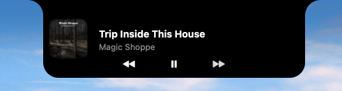

# SoundNotch

A lightweight macOS menu-bar app that shows what's playing on **Spotify** and renders a
**notch-style "now playing" widget** that grows out of the top of your screen — designed to
look like a natural, wider extension of the MacBook notch.

It lives in your menu bar as a `♪`, slides open when a new song starts, and can be expanded
on hover to reveal album art and playback controls.

---

## What it does

- **Menu-bar title** — shows the current track as `♪ Artist – Title` (toggleable).
- **Notch widget** — a pitch-black panel shaped like the physical notch (flush top edge,
  inverted outward-flaring top corners, rounded bottom). It's drawn natively and animated
  at 60 fps.
- **Two states:**
  - **Collapsed (mini bar)** — album art to the *left* of the notch and a `⏭` button to the
    *right*, always visible while a track plays.
  - **Expanded** — album art grows and slides left, the title/artist appear *under* the notch,
    and a centered `⏮ ⏯ ⏭` control row fades in.
- **Smart open/close:**
  - A **new song** briefly expands the widget, then auto-collapses after ~2s.
  - **Hovering** first *peeks* (a slight expand), and only fully expands after a short dwell
    (~0.5s) so quickly moving the mouse past the notch doesn't accidentally open it.
- **Controls** — previous / play-pause / next and volume are driven through Spotify's
  AppleScript interface.
- **Settings** (in the menu, persisted across restarts) — show/hide the notch widget, and
  show/hide the song name in the menu bar.
- **Notch-display aware** — it detects the built-in (notched) display via `CGDisplayIsBuiltin`
  and only appears there, correctly ignoring external monitors (including ones placed *above*
  the laptop screen).

### Collapsed (mini bar)


### Expanded (now playing)



---

## How it's set up

```
spotify_bar.py     ← the menu-bar app (rumps): Spotify polling, hover/state logic, settings, menu
notch_window.py    ← the native AppKit notch widget: shape drawing + animation
install.sh         ← creates the venv and installs a LaunchAgent (start on login + keep alive)
uninstall.sh       ← removes the LaunchAgent and venv
restart.sh         ← reloads the LaunchAgent after code changes
requirements.txt   ← rumps + pyobjc-framework-Quartz
assets/            ← screenshots used in this README
```

**`spotify_bar.py`** is the controller. It's a [`rumps`](https://github.com/jaredks/rumps)
menu-bar app that polls Spotify every 2 seconds via **AppleScript** (`osascript`) to read the
current track, playback state, and volume. A separate 0.1s timer reads the mouse position to
drive the hover behaviour. It owns the settings and persists them to
`~/Library/Application Support/SoundNotch/config.json`.

**`notch_window.py`** is the view. It creates a borderless, non-activating `NSPanel` floating
above the menu bar on the built-in display. The black panel is custom-drawn with `NSBezierPath`
(inverted top corners that flare into the screen), and the collapsed↔expanded transition is a
single hand-rolled interpolation timer that drives the window frame, the shared album-art view
(one image that grows and slides — no duplicates), the control buttons, and the text fade all
in lockstep, with an ease-in-out curve.

**Why AppleScript?** Spotify's desktop app exposes a scripting interface for transport,
position, and volume — no account or network calls required. (Its limits are what shape the
"possible expansions" below.)

**Startup** is handled by a **LaunchAgent** (`com.mathijscop.soundnotch`) with
`RunAtLoad` + `KeepAlive`, and `LSUIElement` so there's no Dock icon. Logs go to
`/tmp/soundnotch.out` and `/tmp/soundnotch.err`.

---

## Requirements

- A Mac **with a notch** (MacBook Pro/Air, 2021 or later).
- The **Spotify desktop app**.
- **Homebrew Python** (the installer expects `/opt/homebrew/bin/python3`; built against
  Python 3.14).

---

## Run it locally

### Quick install (recommended)

```bash
git clone <this-repo> soundnotch
cd soundnotch
./install.sh
```

This creates a `.venv`, installs the dependencies, writes the LaunchAgent, and starts the app.
Look for the `♪` in your menu bar. On first run, macOS will ask for permission to control
**Spotify** and **System Events** — allow both.

To apply code changes:

```bash
./restart.sh
```

To remove everything:

```bash
./uninstall.sh
```

### Run by hand (for development)

```bash
python3 -m venv .venv
.venv/bin/pip install -r requirements.txt
.venv/bin/python3 spotify_bar.py
```

Tail the logs while it runs:

```bash
tail -f /tmp/soundnotch.err
```

---

## Possible expansions

The current build is intentionally dependency-free and uses only Spotify's AppleScript
interface. That interface **cannot** like/save a track, and silently ignores `shuffle`/`repeat`.
Lifting those limits means adding the **Spotify Web API** (OAuth):

- **❤️ Like / Save button** — the headline feature. Requires the Web API:
  1. Register a free app at [developer.spotify.com](https://developer.spotify.com/dashboard)
     to get a **Client ID** and set a redirect URI (e.g. `http://127.0.0.1:8888/callback`).
  2. Do a one-time **Authorization Code + PKCE** flow (no client secret needed) for the scopes
     `user-library-read` + `user-library-modify`; store the refresh token locally.
  3. At runtime: `GET /v1/me/tracks/contains` to show filled/empty heart,
     `PUT`/`DELETE /v1/me/tracks` to toggle. The track ID already comes from AppleScript.
- **Working shuffle / repeat toggles** — also Web API (`PUT /v1/me/player/shuffle` and
  `/repeat`), since AppleScript can't set them.
- **Seek bar / progress** — a draggable scrubber.
- **Stay-open-while-paused** — currently the widget hides when playback stops; it could remain
  visible (paused state) so the play button stays useful.
- **Configurable timings** — expose the dwell delay, auto-collapse, and peek amount as settings.
- **Apple Music support** — the same AppleScript pattern works for the Music app.
- **Multi-notch / per-display options** — choose which display hosts the widget.

---

## Notes

- Settings live in `~/Library/Application Support/SoundNotch/config.json` and survive
  restarts; deleting the file resets to defaults (everything on).
- The widget only renders on the built-in notched display.
